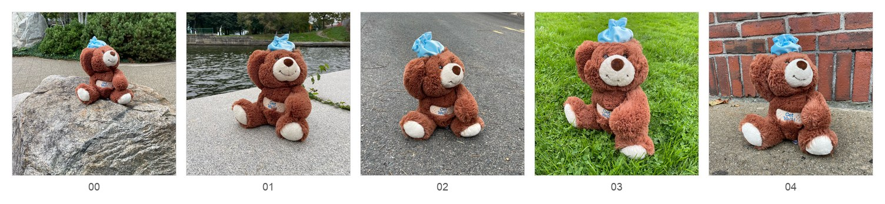
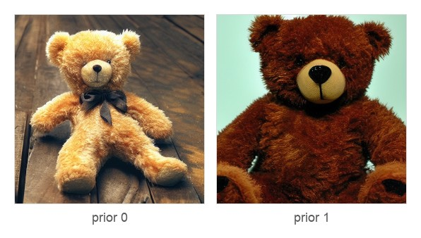
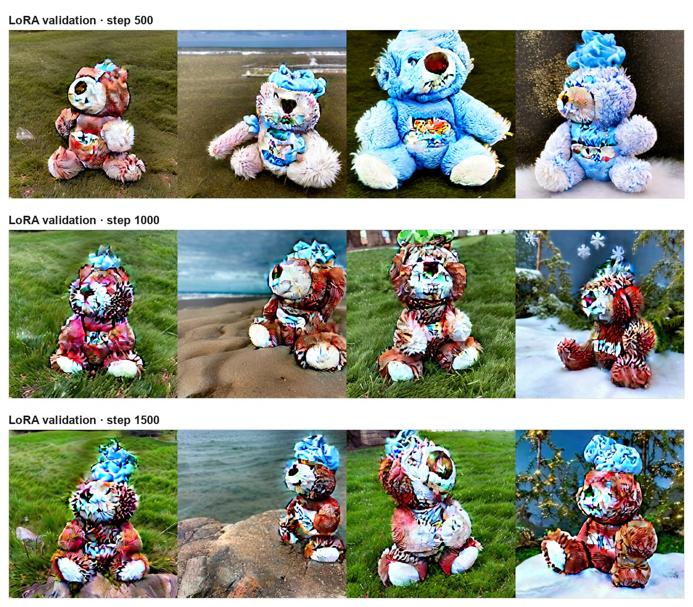
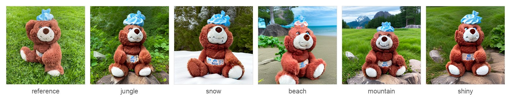
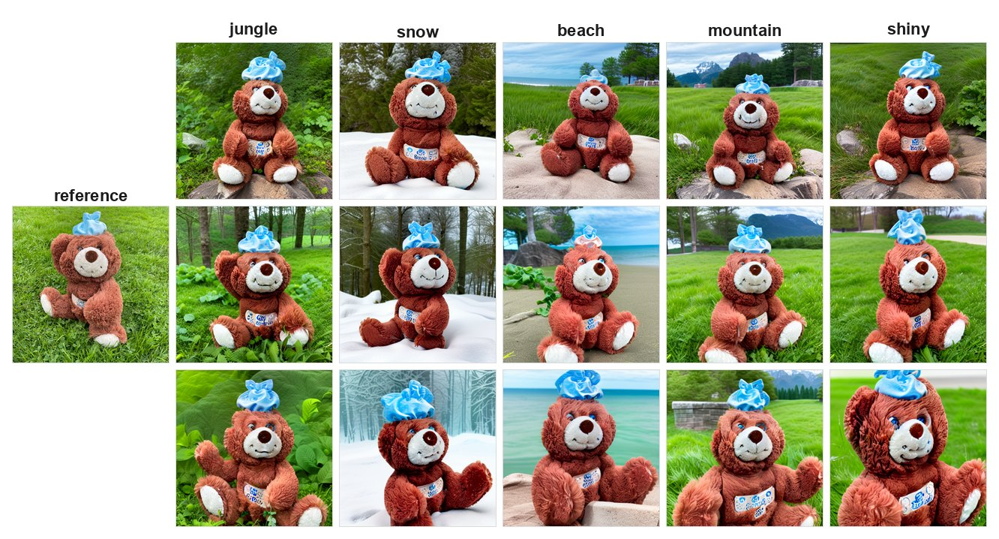

# Efficient SD Personalization

Compute-efficient few-shot personalization pipeline for Stable Diffusion v1.5, combining **Textual Inversion** and **Targeted LoRA** to teach the model a specific subject (bear plushie) from only a handful of images.

## 1. Method

The pipeline personalizes Stable Diffusion in two lightweight stages:

1. **Stage 1 — Textual Inversion.** A new token `<mybear>` is added to the text encoder vocabulary. Only this single embedding vector is trained while all other parameters remain frozen.
2. **Stage 2 — Targeted LoRA.** Low-rank adapters are inserted into selected UNet cross-attention layers (`mid_block`, `down_blocks.2`, `up_blocks.1`). Only the LoRA parameters are optimized, with a prior-preservation loss so the model still knows what a generic teddy bear looks like.

After both stages, prompts that contain `<mybear>` generate this subject in new scenes.

Evaluation uses three scores on the generated images:

- **CLIP-T** — text alignment with the prompt
- **CLIP-I** — similarity to the instance photos
- **DINO-I** — identity fidelity against the instance photos

## 2. Workflow

Run the steps below in order. Prompts and hyperparameters both live in the config that every script reads.

### Prompts

Prompt text is in `data/prompts/`. The placeholder `<mybear>` is set in `configs/project.yaml` and substituted at runtime.

| File | Content | Used by |
| --- | --- | --- |
| `instance_prompt.txt` | `a photo of <mybear> teddy bear` | Stage 1 and Stage 2, instance branch |
| `prior_prompt.txt` | `a photo of a teddy bear` | Prior generation and Stage 2, prior branch |
| `test_prompts.txt` | 5 scenes: jungle, snow, beach, mountain, shiny | Inference and ablation |

### Configuration

Paths, prompts, and training hyperparameters are in `configs/project.yaml`:

```yaml
placeholder_token: "<mybear>"
prompts:
  instance: "a photo of <mybear> teddy bear"
  prior: "a photo of a teddy bear"
training:
  image_size: 512
  textual_inversion_steps: 1500
  lora_rank: 8
  prior_weight: 1.0
```

Scripts take `--config configs/project.yaml` by default. Pass CLI flags only when overriding a value.

### Steps

**0. Install dependencies**

```bash
pip install -r requirements.txt
```

Requires Python 3.9+ and a CUDA GPU (tested on one NVIDIA GPU with at least 12 GB VRAM). CPU runs, but it is much slower.

**1. Download Stable Diffusion v1.5**

Downloads the fp16 weights into `models/base/sd15/`. Needs a Hugging Face token (`huggingface-cli login` or `--token`).

```bash
python scripts/download_model.py
python scripts/download_model.py --token YOUR_HF_TOKEN
```

**2. Prepare instance images**

Put photos of the subject in `data/raw/instance/bear_plushie/`. This repo already has 5 `bear_plushie` images from the Google DreamBooth set.

**3. Generate class-prior images**

Base SD1.5 generates generic teddy bears for the prior-preservation loss.

```bash
python scripts/generate_prior.py                     # default: 100 images
python scripts/generate_prior.py --num_images 50
python scripts/generate_prior.py --batch_size 2      # lower batch for limited VRAM
```

Output: `data/raw/prior/teddy_bear/`

**4. Preprocess images**

Center-crops to a square and resizes instance and prior images to 512×512.

```bash
python scripts/preprocess.py
python scripts/preprocess.py --only instance
python scripts/preprocess.py --only prior
python scripts/preprocess.py --size 256
```

Output: `data/processed/instance_512/` and `data/processed/prior_512/`

**5. Stage 1 — Textual Inversion**

Learns the `<mybear>` embedding. Every other weight stays frozen. This step writes the embedding, not a scene gallery.

```bash
python scripts/train_textual_inversion.py
python scripts/train_textual_inversion.py --steps 2000 --lr 5e-4
python scripts/train_textual_inversion.py --save_every 250
```

Output: `outputs/textual_inversion/learned_embeds.pt` and `outputs/textual_inversion/tokenizer/`

**6. Stage 2 — Targeted LoRA**

Trains LoRA on instance images plus the prior-preservation loss, and writes a validation grid on a fixed schedule.

```bash
python scripts/train_lora.py
python scripts/train_lora.py --steps 1500 --lr 1e-4
python scripts/train_lora.py --rank 16 --batch_size 2
python scripts/train_lora.py --prior_weight 0.5
```

Output: `outputs/lora/final/` and `outputs/samples/validation/`

**7. Inference and evaluation**

Loads SD1.5, the learned embedding, and the LoRA weights, then generates the test prompts and computes CLIP-T, CLIP-I, and DINO-I.

```bash
python scripts/inference.py
python scripts/inference.py --num_images_per_prompt 4
python scripts/inference.py --skip_eval
```

Output: `outputs/samples/inference/` (images and `metrics.json`)

**8. Ablation**

```bash
python scripts/ablation_inference.py --mode base      # SD1.5, no personalization
python scripts/ablation_inference.py --mode ti_only   # Stage 1 embedding only
```

Output: `outputs/samples_base/` and `outputs/samples_ti_only/`

## 3. Results

Figures below are resized previews of the included `bear_plushie` run (`rank=8`, `prior weight=1.0`). Full-resolution files stay in `data/` and `outputs/`.

### 3.1 Images used in training

**Instance photos.** Five DreamBooth photos in `data/raw/instance/bear_plushie/`: a brown teddy with a white muzzle, white paws, a belly patch, and a blue ice bag.

<p align="center">
  
</p>

**Class priors.** Generic teddy bears for prior preservation, not this subject. The two samples are the prior panels of Figure 1 in the project report. The full set belongs in `data/raw/prior/teddy_bear/` and is not checked in.

<p align="center">
  
</p>

### 3.2 During Stage 2

Validation grids written while LoRA trains, at steps 500, 1000, and 1500: `outputs/samples_r8_pw1.0/validation/val_step500.png`, `val_step1000.png`, `val_step1500.png`. These are the same grids as Figure 3 in the project report. Stage 1 training does not write this kind of grid.

<p align="center">
  
</p>

### 3.3 Final results

Both figures are the finished model (Stage 1 embedding + Stage 2 LoRA), from `outputs/samples_r8_pw1.0/inference/`. They are not intermediate stages.

**One sample per scene.** Left is the original photo `data/raw/instance/bear_plushie/03.jpg`. The other five files are jungle `_0`, snow `_0`, beach `_1`, mountain `_0`, and shiny `_0`.

<p align="center">
  
</p>

**Three samples per scene.** Same output folder, samples `_0` `_1` `_2` for each test prompt, with `03.jpg` as the reference. This is the layout of Figure 2 in the project report.

<p align="center">
  
</p>

## 4. Directory Layout

The `rank=8`, `prior weight=1.0` outputs and ablations are already under `outputs/`.

```text
.
├── configs/
│   └── project.yaml                # centralized project configuration
├── data/
│   ├── prompts/                    # prompt text files (see Workflow)
│   │   ├── instance_prompt.txt
│   │   ├── prior_prompt.txt
│   │   └── test_prompts.txt
│   ├── raw/
│   │   ├── instance/bear_plushie/  # original instance photos
│   │   └── prior/teddy_bear/       # generated class-prior images
│   └── processed/
│       ├── instance_512/           # center-cropped & resized instance images
│       └── prior_512/              # center-cropped & resized prior images
├── docs/
│   └── figures/                    # resized previews used in this README
├── logs/                           # training logs
├── models/
│   └── base/sd15/                  # local Stable Diffusion v1.5 weights (fp16)
├── notebooks/                      # exploratory notebooks
├── outputs/
│   ├── textual_inversion/          # learned embeddings & tokenizer
│   ├── lora/                       # LoRA checkpoints
│   ├── samples/
│   │   ├── inference/              # final generated images + metrics.json
│   │   └── validation/             # validation grids from LoRA training
│   ├── samples_base/               # ablation: base SD1.5 outputs
│   ├── samples_ti_only/            # ablation: Stage 1 only
│   └── samples_r8_pw1.0/           # included experiment outputs
├── scripts/                        # runnable scripts (see Workflow)
├── requirements.txt
└── README.md
```

## References

- [DreamBooth: Fine Tuning Text-to-Image Diffusion Models for Subject-Driven Generation](https://arxiv.org/abs/2208.12242)
- [An Image is Worth One Word: Personalizing Text-to-Image Generation using Textual Inversion](https://arxiv.org/abs/2208.01618)
- [LoRA: Low-Rank Adaptation of Large Language Models](https://arxiv.org/abs/2106.09685)
- [Stable Diffusion v1.5](https://huggingface.co/stable-diffusion-v1-5/stable-diffusion-v1-5)
